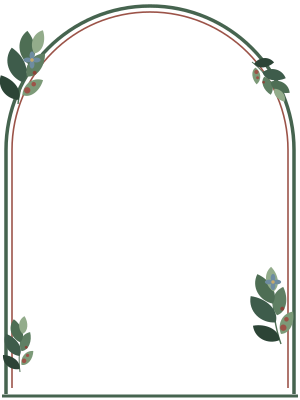

# /wedding

Jared &amp; Hannah — July 17, 2027, Peabody Essex Museum, Salem MA.

Served straight off GitHub Pages at `https://www.antisocialistic.com/wedding/`.
Plain static HTML: no build step, no framework. It reuses the Bootstrap 4.5.3
already vendored at the repo root (`../bootstrap/`) and adds one stylesheet of
its own. There is no JS dependency — the navbar toggle and countdown are a
dozen lines of vanilla script at the bottom of `index.html`.

```
wedding/
  index.html            the home page
  css/wedding.css       theme tokens, layout, picture-frame classes
  img/frames/*.svg      the reusable picture frames
  img/photo-*.svg       placeholders, meant to be replaced with real photos
```

## Palette

Muted garden red, dusty blue and deep green on warm parchment. All of it lives
in CSS custom properties at the top of `css/wedding.css` (`--green-700`,
`--red-500`, `--blue-500`, `--cream`, …). Change them there and the whole page
follows.

## Swapping in real photos

Each frame wants a photo at a particular aspect ratio. Drop the file in `img/`
and change the `src` — nothing else needs touching, and `object-fit: cover`
absorbs small ratio mismatches.

| Frame | Class | Ratio | Placeholder to replace |
| --- | --- | --- | --- |
| Garden arch | `pf pf--arch` | 3:4 portrait | `photo-placeholder-arch.svg` |
| Leaf wreath | `pf pf--wreath` | 1:1 square | `photo-placeholder-square.svg` |
| Ornate botanical | `pf pf--ornate` | any (landscape suits it) | `photo-placeholder-landscape.svg` |

The arch and wreath are overlay frames — the SVG sits on top of the photo:

```html
<figure class="pf pf--arch">
  <span class="pf__photo"></span>
  
</figure>
```

The ornate one is a real CSS `border-image`, so it needs no overlay and stretches
to whatever ratio the photo happens to be:

```html
<figure class="pf pf--ornate">
  
</figure>
```

## Two things to know before editing the frames

Both are load-bearing, and both are easy to break by accident.

**The overlay frames align by proportion, not by pixel.** `frame-arch.svg` is a
300×400 drawing whose photo opening is inset 12 units on every side; the figure
is locked to `aspect-ratio: 3 / 4` and the photo is inset `3% 4%` (12/400 and
12/300) with a `border-radius` that reproduces the SVG's arch. Because both the
SVG and the photo scale uniformly, they stay aligned at every size. Change the
inset in one place and you have to change it in the other. The wreath works the
same way at `inset: 12%` of a square.

Note the inset lives on the `.pf__photo` wrapper, not on the `` and not as
percentage padding on the figure. Neither shortcut works: an absolutely
positioned *replaced* element resolves `width: auto` to its intrinsic width and
throws away the opposing offset (which overflows the page), and percentage
padding resolves against the *parent's* width rather than the figure's.

**`frame-ornate.svg` is sliced into nine tiles.** `border-image ... 100` cuts the
300×300 drawing on the 100-unit grid: four corner tiles carry the leaf sprays,
four edge tiles carry a vine that repeats (`round`), and the centre is dropped.
Any artwork that crosses a slice boundary gets cut in half, so ornaments must
stay inside their own tile. The straight rules are drawn as full-width `rect`s
on purpose — every tile then carries its matching segment and the lines stay
continuous however many times the edges repeat.

## Still to build

`#rsvp` is a placeholder anchor and the RSVP nav link is disabled. Our Story,
travel/lodging for Salem, and the weekend schedule are stubs on this page for
now, ready to become their own pages under `/wedding/`.
